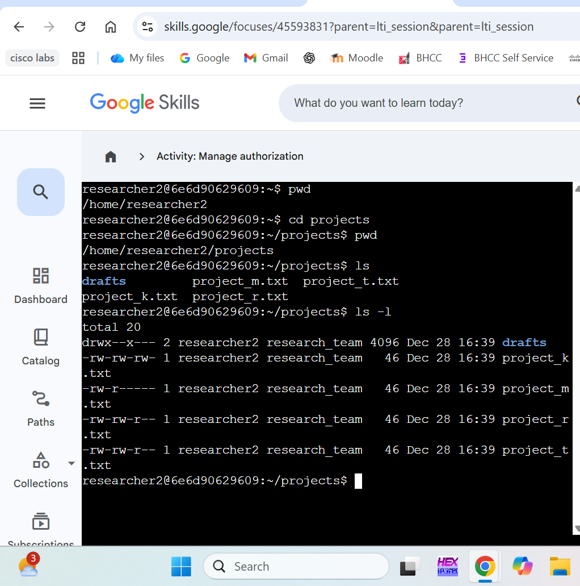

# Linux Authorization: Managing File and Directory Permissions

## 🛡️ Project Overview
In this project, I acted as a security analyst for a research team to audit and refine file authorizations. I identified misconfigured permissions on visible and hidden files and corrected them using the Linux command line to ensure adherence to the Principle of Least Privilege.

## 🚀 Lab Walkthrough

### 1. Initial System Audit
I began by navigating to the `projects` directory and listing all files, excluding the hidden ones for now, to view their current permission strings.
* **Command:** `ls -l`

### 2. Correcting Authorization Gaps
I identified several files with insecure permissions. For example, `project_k.txt` allowed "others" to write to it, and `project_m.txt` allowed group read access to a restricted file.

**Handling Errors:**
During the lab, I initially encountered an error when trying to use a comma in the `chmod` command without proper spacing. I corrected this by using the standard `u=r,g=r` syntax.
* **Correction:** `chmod u=r,g=r .project_x.txt`

### 3. Securing the Drafts Directory
Finally, I modified the `drafts` directory to ensure only the user `researcher2` has execute privileges, effectively revoking group access.
* **Command:** `chmod g-x drafts`

---

## 🧠 Security Perspective
* **Data Integrity:** By fixing the write permissions on `project_k.txt`, I prevented unauthorized modification of research data.
* **Privacy:** Revoking group access to the `drafts` directory ensures that sensitive, incomplete work remains private to the researcher.
* **Hidden File Security:** Hardening `.project_x.txt` is vital as hidden files are often overlooked during manual audits.

---

## 📝 My Personal Insights
> While doing this lab, I realized how easy it is to make a syntax error in `chmod`. I actually appreciated getting that error message because it forced me to double-check the command logic. Seeing the `x` disappear from the group permissions on the `drafts` directory gave me a real sense of how access control is implemented in the real world.
