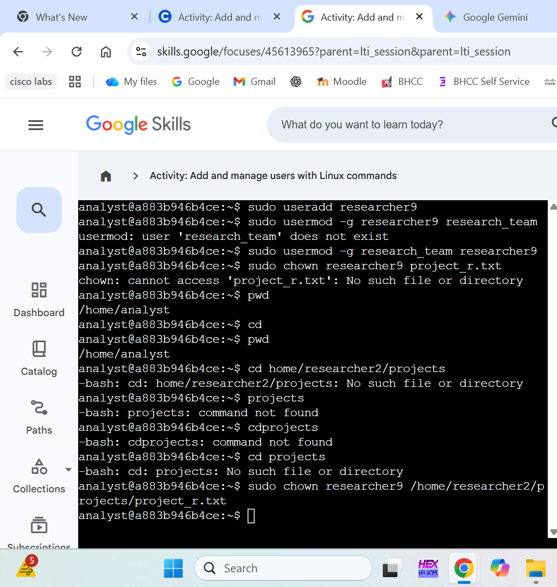
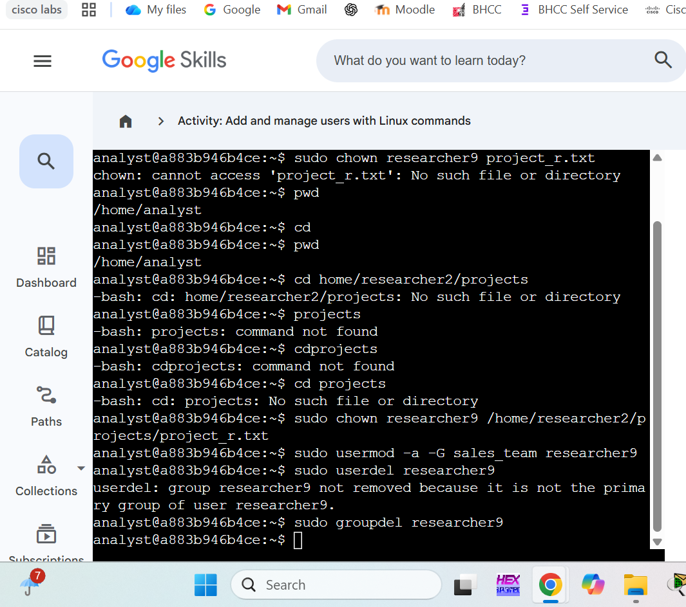

# Linux User Management: Authentication and Identity Control

## 🛡️ Project Overview
This project involved managing the full lifecycle of a user account for a new employee, `researcher9`. I practiced Identity and Access Management (IAM) by provisioning a new account, modifying group memberships, reassigning file ownership, and securely offboarding the user.

## 🚀 Lab Walkthrough

### 1. User Provisioning and Initial Configuration
I began by creating the `researcher9` account and assigning them to the `research_team` primary group. This step established the user's initial identity and baseline authorizations within the system.
* **Command:** `sudo useradd researcher9`
* **Command:** `sudo usermod -g research_team researcher9`

### 2. Troubleshooting Paths and Secure Offboarding
I was tasked with changing ownership of `project_r.txt` to the new user. As seen in the documentation below, I encountered "No such file" errors which I resolved by using the absolute path. Once the user's tenure ended, I removed their secondary group access and deleted the account and its associated group to ensure system cleanliness.
* **Command:** `sudo chown researcher9 /home/researcher2/projects/project_r.txt`
* **Command:** `sudo userdel researcher9`
* **Command:** `sudo groupdel researcher9`

